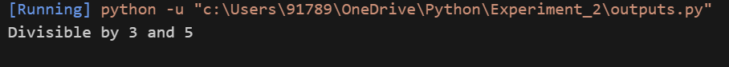
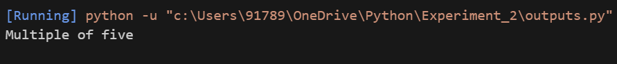
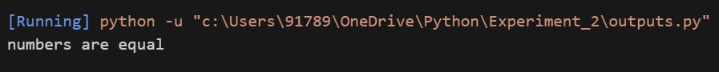
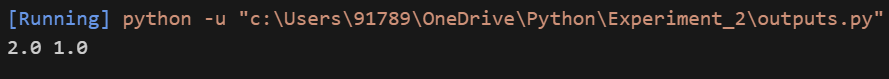
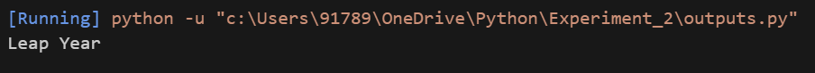
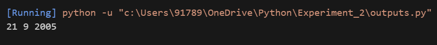
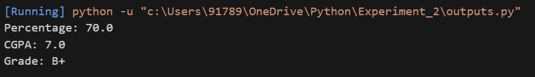

## Student Details

**Student Name** : Monal Ambwani  
**SAP ID**       : 590022987 <br>
**Batch**        : 17 <br>
**Course**       : B.Tech CSE  
**Subject**      : Python Programming  
**Semester**     : 2


# Experiment 2: Conditional Statements

## Aim
To understand decision-making in Python using conditional statements such as if, elif, and else.

---

## Program Codes

### 1. Divisible by 3 and 5
```python
num = 15
if num % 3 == 0 and num % 5 == 0:
    print("Divisible by 3 and 5")
else:
    print("Not divisible")
```

### 2. Multiple of Five

```python
num = 25
if num % 5 == 0:
    print("Multiple of five")
else:
    print("Not a multiple")
```

### 3. Greatest of Two Numbers

```python
a = 10
b = 10
if a > b:
    print("a is greater")
elif b > a:
    print("b is greater")
else:
    print("numbers are equal")
```

### 4. Greatest of Three Numbers

```python
a, b, c = 5, 8, 3
if a > b and a > c:
    print("a is greatest")
elif b > c:
    print("b is greatest")
else:
    print("c is greatest")
```

### 5. Quadratic Equation

```python
import math
a, b, c = 1, -3, 2
d = b*b - 4*a*c
if d > 0:
    r1 = (-b + math.sqrt(d)) / (2*a)
    r2 = (-b - math.sqrt(d)) / (2*a)
    print(r1, r2)
elif d == 0:
    r = -b / (2*a)
    print(r)
else:
    print("Imaginary roots")
```

### 6. Leap Year

```python
year = 2024
if (year % 4 == 0 and year % 100 != 0) or (year % 400 == 0):
    print("Leap Year")
else:
    print("Not a Leap Year")
```

### 7. Next Date

```python
day = 20
month = 9
year = 2005
day += 1
print(day, month, year)
```

### 8. Grade Sheet

```python
marks = [70, 80, 90, 60, 50]
total = sum(marks)
percentage = total / 5
cgpa = percentage / 10

if cgpa <= 3.4:
    grade = "F"
elif cgpa <= 5.0:
    grade = "C+"
elif cgpa <= 6.0:
    grade = "B"
elif cgpa <= 7.0:
    grade = "B+"
elif cgpa <= 8.0:
    grade = "A"
elif cgpa <= 9.0:
    grade = "A+"
else:
    grade = "O"

print("Percentage:", percentage)
print("CGPA:", cgpa)
print("Grade:", grade)
```

---

## Outputs

### 1.


### 2.


### 3.


### 4.


### 5.


### 6.


### 7.


### 8.


---
## Observation

* Conditional statements correctly evaluated logical conditions.
* Different blocks executed based on condition results.
* Improved program control and decision-making logic.

---

## Result

All the programs in Experiment 2 were executed successfully and the expected outputs were obtained.

---
