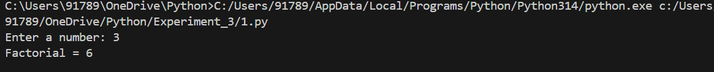
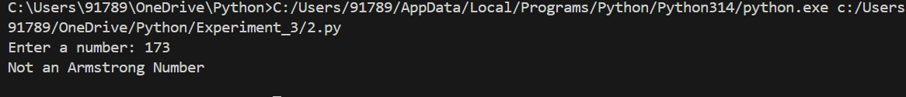
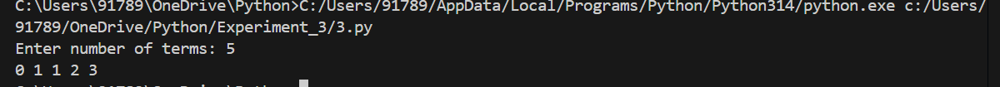
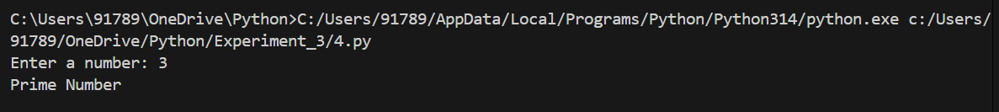
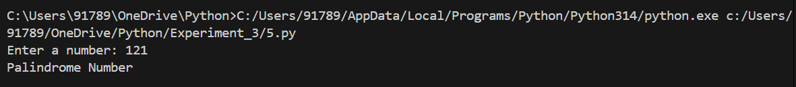
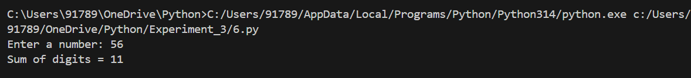
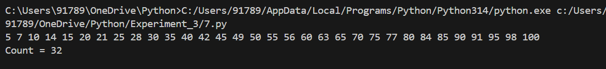
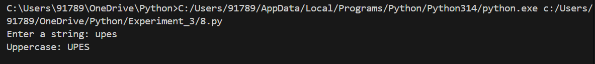
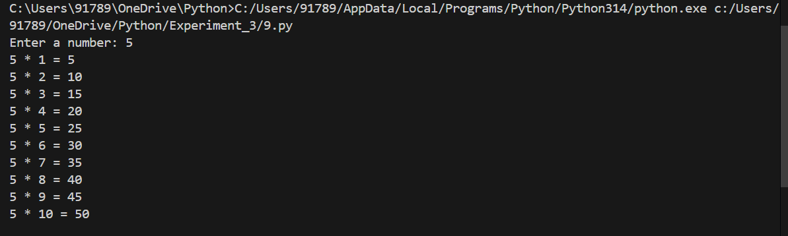
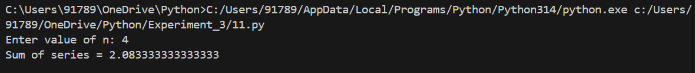

## Student Details
---
**Student Name** : Monal Ambwani  
**SAP ID**       : 590022987 <br>
**Batch**        : 17 <br>
**Course**       : B.Tech CSE  
**Subject**      : Python Programming  
**Semester**     : 2

---


# Experiment 3: Loops in Python


## Aim

To study and implement looping statements in Python.

---

## Theory

Loops are used to execute a block of code repeatedly until a certain condition is satisfied.

- **for loop**: Used when the number of iterations is known.
- **while loop**: Used when the number of iterations depends on a condition.

---

## Program Codes

### 1. Factorial of a Number

```python
n = int(input("Enter a number: "))

fact = 1
for i in range(1, n + 1):
    fact *= i

print("Factorial =", fact)
```

---

### 2. Armstrong Number

```python
num = int(input("Enter a number: "))

temp = num
total = 0

while temp > 0:
    digit = temp % 10
    total += digit ** 3
    temp //= 10

if total == num:
    print("Armstrong Number")
else:
    print("Not an Armstrong Number")
```

---

### 3. Fibonacci Series

```python
n = int(input("Enter number of terms: "))

a, b = 0, 1
for i in range(n):
    print(a, end=" ")
    a, b = b, a + b
```

---

### 4. Prime Number Check

```python
num = int(input("Enter a number: "))

if num > 1:
    for i in range(2, num):
        if num % i == 0:
            print("Not a Prime Number")
            break
    else:
        print("Prime Number")
else:
    print("Not a Prime Number")
```

---

### 5. Palindrome Number

```python
num = int(input("Enter a number: "))

rev = 0
temp = num

while temp > 0:
    rev = rev * 10 + temp % 10
    temp //= 10

if rev == num:
    print("Palindrome Number")
else:
    print("Not a Palindrome")
```

---

### 6. Sum of Digits

```python
num = int(input("Enter a number: "))

total = 0
while num > 0:
    total += num % 10
    num //= 10

print("Sum of digits =", total)
```

---

### 7. Numbers Divisible by 5 or 7

```python
count = 0

for i in range(1, 101):
    if i % 5 == 0 or i % 7 == 0:
        print(i, end=" ")
        count += 1

print("\nCount =", count)
```

---

### 8. Lowercase to Uppercase

```python
text = input("Enter a string: ")

result = ""
for ch in text:
    result += ch.upper()

print("Uppercase:", result)
```

---

### 9. Multiplication Table

```python
num = int(input("Enter a number: "))

for i in range(1, 11):
    print(num, "*", i, "=", num * i)
```

---

### 10. Pattern Printing

```python
for i in range(5, 0, -1):
    for j in range(1, i + 1):
        print(j, end="")
    for k in range(6 - i):
        print("*", end="")
    for k in range(6 - i):
        print("*", end="")
    for j in range(i, 0, -1):
        print(j, end="")
    print()
```

---

### 11. Sum of Series

```python
n = int(input("Enter value of n: "))

series_sum = 0.0
for i in range(1, n + 1):
    series_sum += 1 / i

print("Sum of series =", series_sum)
```

---

## Outputs

### 1. Factorial of a Number



### 2. Armstrong Number



### 3. Fibonacci Series 



### 4. Prime Number Check



### 5. Palindrome Number



### 6. Sum of Digits


### 7. Numbers Divisible by 5 or 7


### 8. Lowercase to Uppercase


### 9. Multiplication Table


### 10. Pattern Printing


### 11. Sum of Series


---

## Result

All the programs were executed successfully and looping statements in Python were implemented correctly.
